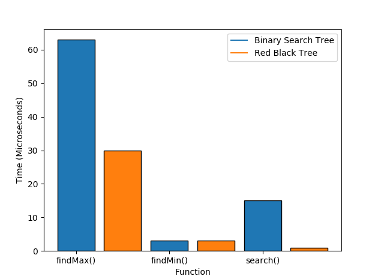
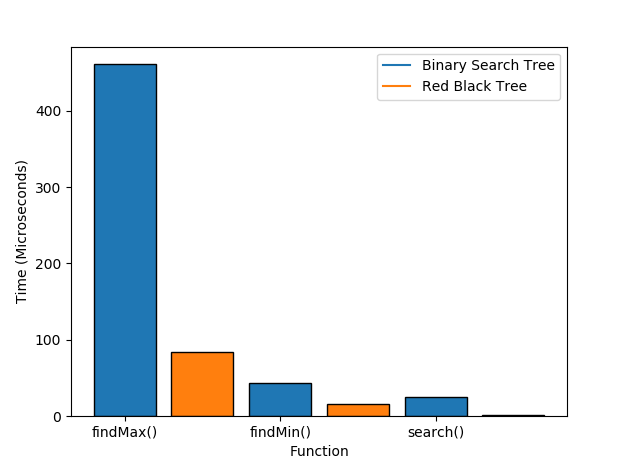
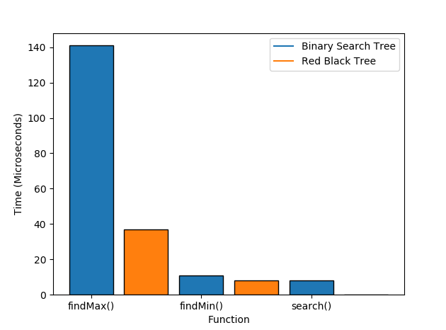
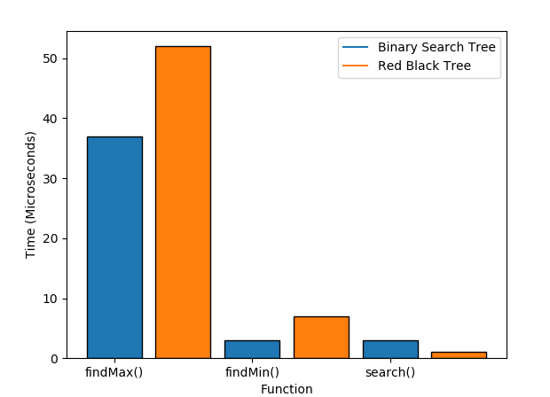

# CS240 Group Documentation

## Collaborators
- Cindy Guo
- Cat Tran
- Barrett Sweet

## Project Description
Build an application to implement a binary search tree and a red black tree and test the time complexity for n amounts of input.

## Requirements
The program will be run as follows by typing make to compile:
**./proj FILE_PATH**

The input file, FILE_PATH, containing integers will be fed to the main program and the program will build a red-black tree and a binary tree from the input. The program will then output the time needed for the red-black tree and binary tree to execute each of the following commands: building the tree, execute a search for a random number, removing a random number, and finding the maximum and minimum node of the tree. Upon successful execution, the time required for the red-black tree and the binary tree to execute each command will be displayed in seconds. 

## Properties of Red-Black Trees
1. Every node contains a color (red or black)
2. The root node is black
3. If a node is red, then its parent and children (if any) must be black
4. Inserted nodes are initially red

Lastly, a RBT retains all properties of a BST.

## Desired Output
n = seconds to run function
||findMin()|findMax()|findK()|buildTree()|
|---|---|---|---|---|
|BST| n | n | n | n |
|RBT| n | n | n | n |

## Classes
### BST Methods
#### insert
- Input: int value to insert
- Output: none
#### findMin
- Input: none
- Output: integer min_value
#### findMax
- Input: none
- Output: integer max_value
#### findK
- Input: an arbitrary value k to search for
- Ouput: boolean found_k
### RBT Methods
#### insert
- Input: int value to insert
- Output: none
#### findMin
- Input: none
- Output: integer min_value
#### findMax
- Input: none
- Output: integer max_value
#### findK
- Input: an arbitrary value k to search for
- Ouput: boolean found_k

## Other Methods

### File: io.cc

#### inputFile
- Input: file of integers
- Output: None

#### outputTable
- Purpose: output timing data for different data structures and methods run on them
- Input: Timing data as a 2D array
- Input: column labels 
- Input: row labels
- Output: Table formatted with timing data
- std::vector<int> genInputNumbers(int length, int max);
  - ##### Helper functions
  - void outputColLabels(std::vector<std::string> colLabels);
  - void outputDivider(int size);
  - void outputRowLabel(std::string label);
  - void outputData(double data, int p);
##### Helper functions
- void outputColLabels(std::vector<std::string> colLabels);
- void outputDivider(int size);
- void outputRowLabel(std::string label);
- void outputData(double data, int p);

#### getCurrentTime
- Input: none
- Output: number of milliseconds since epoch time

#### Generate input numbers
- Input: integer n: number of ints to generate
- Input: int n: number of ints to generate
- Output: An array or file containing ints

#### Parse command line args
- Input: argv
- Output: Control flow

### File: graph.cc

#### Dependencies:
- matplotlibcpp.h
- Python 2.7
- Numpy

#### makeGraph
- Purpose: Create a graph comparing timing data from different data structures and methods run on them.
- Input: Will accept timing data in future update
- Output: A graph. Returns void.

##### Helper functions
- labelSpacing
- Input: int numLabels: The number of x axis labels

## Results && Analysis:
#### Binary Search Trees
|  |Average|Worst|
------|------|------
|Search| O(lg n) | O(n) | 
|Insert| O(lg n) | O(n) |
|Delete| O(lg n) | O(n) | 
|Max| O(lg n) | O(n) | 
|Min| O(lg n) | O(n) | 

- Binary Search Trees can become inbalanced depending on the input or even become a linear chain in the worst case, making all operations O(n).

#### Red-Black Trees
|  |Average|Worst|
------|------|------
|Search| O(lg n) | O(lg n) | 
|Insert| O(lg n) | O(lg n) |
|Delete| O(lg n) | O(lg n) | 
|Max| O(lg n) | O(lg n) |
|Min| O(lg n) | O(lg n) | 

- Red-Black Trees are garunteed to be balanced with O(lg n) height for n elements. [Proof on Height of RBT](http://www.dgp.toronto.edu/~jstewart/378notes/16redBlack/)
- RBTs only require a single bit to maintain the coloring of the tree so the amount of space it takes is almost the same as the BST.
- Recoloring the RBT for inserts and deletions is O(1) since it only involves changing the color bit.
- Rebalancing the tree involves switching around some pointers depending on the color of the node and the color of surrounding nodes. To fix any violations that occur from inserting or deleting, restoring the tree is O(lg n) because the whole tree may need to be restructured to abide by the restrictions of a RBT.
- Implementation is more complex than the BST because there are many cases that must be considered for recoloring and rebalancing in order to maintain the properties of the RBT, particularly in insertion and deletion.

### Program Output Results:
#### All timing data in microseconds
1. Running the program with an input of **10000 integers** in ascending order (./proj ord_1000000)

| Data Structure | buildTree()    | findMax()      | findMin()      | search()     |  
-----------------|----------------|----------------|----------------|--------------|
| BST            | 291434         | 63             | 3              | 15           | 
| RBT            | 4562           | 30             | 3              | 1            |

1. Running the program with an input of **100000 integers** in **ascending order** (./proj ord_100000)

| Data Structure | buildTree()    | findMax()      | findMin()      | search()       |
-----------------|----------------|----------------|----------------|----------------|
| BST            | 24376269       | 461            | 44             | 25             |
| RBT            | 68430          | 84             | 16             | 2              |

1. Running the program with an input of **10000 integers** in **random order** (./proj ran_10000)

| Data Structure | buildTree()    | findMax()      | findMin()      | search()       |
-----------------|----------------|----------------|----------------|----------------|
| BST            | 4671           | 141            | 11             | 8              |
| RBT            | 5327           | 37             | 8              | 0              |

1. Running the program with an input of **100000 integers** in **random order** (./proj ran_100000)

| Data Structure | buildTree()    | findMax()      | findMin()      | search()       |
-----------------|----------------|----------------|----------------|----------------|
| BST            | 68106          | 37             | 3              | 3              |
| RBT            | 95496          | 52             | 7              | 1              |

## References:
1. https://www.geeksforgeeks.org/red-black-tree-set-3-delete-2/
2. https://algorithmtutor.com/Data-Structures/Tree/Red-Black-Trees/
3. http://www.dgp.toronto.edu/~jstewart/378notes/16redBlack/
